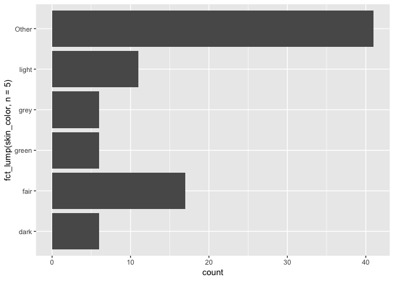
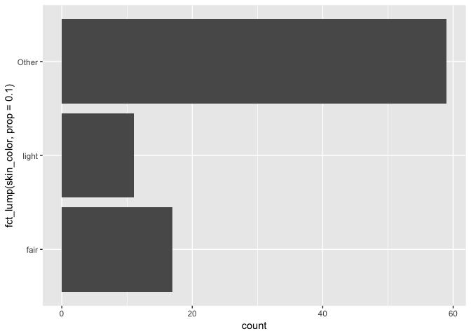
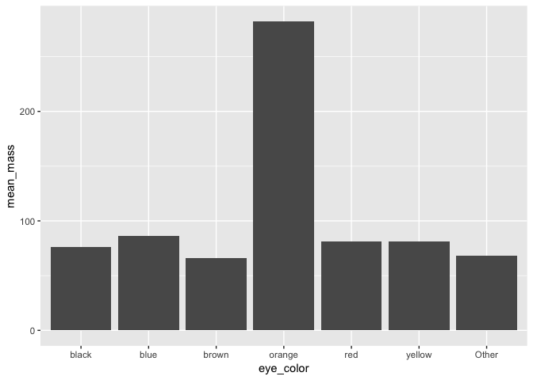
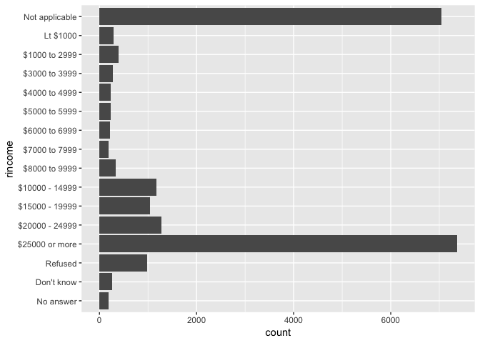
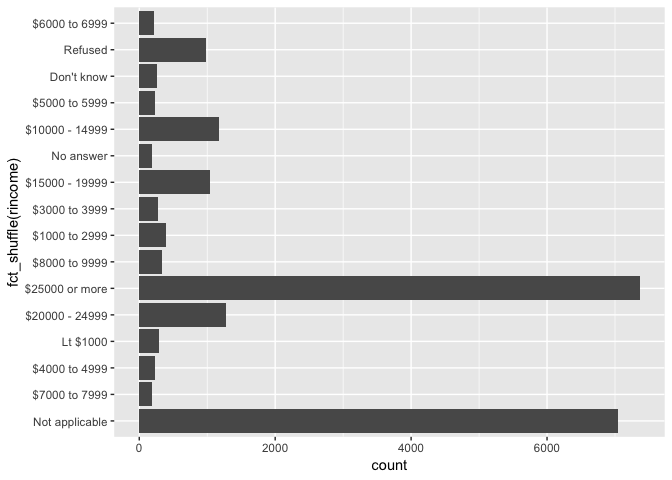

<!-- README.md is generated from README.Rmd. Please edit that file -->
forcats 
========================================================

[](https://cran.r-project.org/package=forcats) [](https://travis-ci.org/tidyverse/forcats) [](https://codecov.io/github/tidyverse/forcats?branch=master)

Overview
--------

R uses **factors** to handle categorical variables, variables that have a fixed and known set of possible values. Historically, factors were much easier to work with than character vectors, so many base R functions automatically convert character vectors to factors. (For historical context, I recommend [*stringsAsFactors: An unauthorized biography*](http://simplystatistics.org/2015/07/24/stringsasfactors-an-unauthorized-biography/) by Roger Peng, and [*stringsAsFactors = &lt;sigh&gt;*](http://notstatschat.tumblr.com/post/124987394001/stringsasfactors-sigh) by Thomas Lumley. If you want to learn more about other approaches to working with factors and categorical data, I recommend [*Wrangling categorical data in R*](https://peerj.com/preprints/3163/), by Amelia McNamara and Nicholas Horton.) These days, making factors automatically is no longer so helpful, so packages in the [tidyverse](http://tidyverse.org) never create them automatically.

However, factors are still useful when you have true categorical data, and when you want to override the ordering of character vectors to improve display. The goal of the **forcats** package is to provide a suite of useful tools that solve common problems with factors. If you're not familiar with factors, the best place to start is the [chapter on factors](http://r4ds.had.co.nz/factors.html) in R for Data Science.

Installation
------------

``` r
# The easiest way to get forcats is to install the whole tidyverse:
install.packages("tidyverse")

# Alternatively, install just forcats:
install.packages("forcats")

# Or the the development version from GitHub:
# install.packages("devtools")
devtools::install_github("tidyverse/forcats")
```

Getting started
---------------

forcats is now part of the core tidyverse, so you do not need to load it explicitly:

``` r
library(tidyverse)
```

Let's try answering the question "what are the most common homeworld of starwars characters?" Let's start off by making a barplot

``` r
ggplot(starwars, aes(x = hair_color)) + 
  geom_bar() + 
  coord_flip()
```


That's okay, but it would be more helpful the graph was ordered by count. This is a case of an **unordered** categorical variable where we want it ordered by its frequency. We can use the function `fct_infreq`:

``` r
ggplot(starwars, aes(x = fct_infreq(hair_color))) + 
  geom_bar() + 
  coord_flip()
```


Note that it automatically puts NA at the top, even though that doesn't have the smallest number of entries.

What if we want to do a similar plot for skin color?

``` r
ggplot(starwars, aes(x = fct_infreq(skin_color))) + 
  geom_bar() + 
  coord_flip()
```


Here we have a lot of different skin colors - let's reduce it to only be the top 5. We can use `fct_lump` to "lump" all the infrequent colors into one factor, "other." The argument `n` is the number of levels we want to keep.

``` r
ggplot(starwars, aes(x = fct_lump(skin_color, n = 5))) + 
  geom_bar() + 
  coord_flip()
```



We could also have used `prop` instead, which keeps all the levels that appear at least `prop` of the time. For example, let's keep skin colors that at least 10% of the characters have:

``` r
ggplot(starwars, aes(x = fct_lump(skin_color, prop = .1))) + 
  geom_bar() + 
  coord_flip()
```



Only light and fair remain; everything else is other.

What if we wanted to see if the average mass differed by eye color? We'll only look at the 6 most popular eye colors and remove NAs.

``` r
starwars %>%
  mutate(eye_color = fct_lump(eye_color, n = 6)) %>%
  group_by(eye_color) %>%
  summarise(mean_mass = mean(mass, na.rm = TRUE)) %>%
  ggplot(aes(x = eye_color, y = mean_mass)) + 
  geom_col()
```



It looks like people (or at least one person) with orange eyes is definitely heavier! This graph would look nice though if it was ordered by `mean_mass`. We can do this with `fct_reorder`, which reorders one variable by another.

``` r
starwars %>%
  mutate(eye_color = fct_lump(eye_color, n = 6)) %>%
  group_by(eye_color) %>%
  summarise(mean_mass = mean(mass, na.rm = TRUE)) %>%
  mutate(eye_color = fct_reorder(eye_color, mean_mass)) %>%
  ggplot(aes(x = eye_color, y = mean_mass)) + 
  geom_col()
```


Let's switch to using another dataset, `gss_cat`, the general social survey. What is the income distribution among the respondents?

``` r
ggplot(gss_cat, aes(x = rincome)) +
   geom_bar() + 
   coord_flip()
```



Notice that the income levels are in the correct order - they go from `"Lt $1000"` to `$25,000 or more`. This is not a coicidence. When you're working with ordinal data, where there is an order, you can have an ordered factor. You can examine them with the base function `levels`, which prints them in order:

``` r
levels(gss_cat$rincome)
#>  [1] "No answer"      "Don't know"     "Refused"        "$25000 or more"
#>  [5] "$20000 - 24999" "$15000 - 19999" "$10000 - 14999" "$8000 to 9999" 
#>  [9] "$7000 to 7999"  "$6000 to 6999"  "$5000 to 5999"  "$4000 to 4999" 
#> [13] "$3000 to 3999"  "$1000 to 2999"  "Lt $1000"       "Not applicable"
```

But what if your factor came in the wrong order? Let's simulate that by reordering the levels of `rincome` randomly with `fct_shuffle` and then plotting it again.

``` r
ggplot(gss_cat, aes(x = fct_shuffle(rincome))) +
   geom_bar() + 
   coord_flip()
```



How can we fix this and put it in the right order?

We can use the function `fct_relevel` when we need to manually reorder our factor levels. In addition to the factor, you give it a character vector of level names and specify where you want to move them. It defaults to moving them to the front, but you can move them after another level with the argument `after`. If you want to move it to the end, you set `after` equal to `Inf`.

For example, let's say we wanted to move `Lt $1000` and `$1000 to 2999` to the front. We would write:

``` r
fct_relevel(gss_cat$rincome, c("Lt $1000", "$1000 to 2999")) %>%
  levels()
#>  [1] "Lt $1000"       "$1000 to 2999"  "No answer"      "Don't know"    
#>  [5] "Refused"        "$25000 or more" "$20000 - 24999" "$15000 - 19999"
#>  [9] "$10000 - 14999" "$8000 to 9999"  "$7000 to 7999"  "$6000 to 6999" 
#> [13] "$5000 to 5999"  "$4000 to 4999"  "$3000 to 3999"  "Not applicable"
```

What if we want to move them to the second and third place?

``` r
fct_relevel(gss_cat$rincome, c("Lt $1000", "$1000 to 2999"), after = 1) %>%
  levels()
#>  [1] "No answer"      "Lt $1000"       "$1000 to 2999"  "Don't know"    
#>  [5] "Refused"        "$25000 or more" "$20000 - 24999" "$15000 - 19999"
#>  [9] "$10000 - 14999" "$8000 to 9999"  "$7000 to 7999"  "$6000 to 6999" 
#> [13] "$5000 to 5999"  "$4000 to 4999"  "$3000 to 3999"  "Not applicable"
```

Getting help
------------

If you encounter a clear bug, please file a minimal reproducible example on [github](https://github.com/tidyverse/dplyr/issues). For questions and other discussion, please use [community.rstudio.com](https://community.rstudio.com/), or the [manipulatr mailing list](https://groups.google.com/group/manipulatr).
