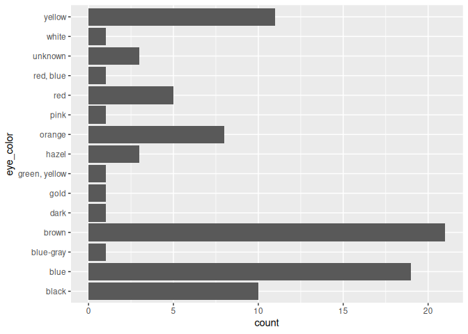

<!-- README.md is generated from README.Rmd. Please edit that file -->

# forcats 

<!-- badges: start -->

[](https://cran.r-project.org/package=forcats)
[](https://github.com/tidyverse/forcats/actions/workflows/R-CMD-check.yaml)
[](https://app.codecov.io/gh/tidyverse/forcats?branch=main)
<!-- badges: end -->

## Overview

R uses **factors** to handle categorical variables, variables that have
a fixed and known set of possible values. Factors are also helpful for
reordering character vectors to improve display. The goal of the
**forcats** package is to provide a suite of tools that solve common
problems with factors, including changing the order of levels or the
values. Some examples include:

-   `fct_reorder()`: Reordering a factor by another variable.
-   `fct_infreq()`: Reordering a factor by the frequency of values.
-   `fct_relevel()`: Changing the order of a factor by hand.
-   `fct_lump()`: Collapsing the least/most frequent values of a factor
    into “other”.

You can learn more about each of these in `vignette("forcats")`. If
you’re new to factors, the best place to start is the [chapter on
factors](https://r4ds.had.co.nz/factors.html) in R for Data Science.

## Installation

    # The easiest way to get forcats is to install the whole tidyverse:
    install.packages("tidyverse")

    # Alternatively, install just forcats:
    install.packages("forcats")

    # Or the the development version from GitHub:
    # install.packages("devtools")
    devtools::install_github("tidyverse/forcats")

## Cheatsheet

<a href="https://raw.githubusercontent.com/rstudio/cheatsheets/main/factors.pdf"></a>

## Getting started

forcats is part of the core tidyverse, so you can load it with
`library(tidyverse)` or `library(forcats)`.

``` r
library(forcats)
library(dplyr)
library(ggplot2)
```

``` r
starwars %>% 
  filter(!is.na(species)) %>%
  count(species, sort = TRUE)
#> # A tibble: 37 × 2
#>    species      n
#>    <chr>    <int>
#>  1 Human       35
#>  2 Droid        6
#>  3 Gungan       3
#>  4 Kaminoan     2
#>  5 Mirialan     2
#>  6 Twi'lek      2
#>  7 Wookiee      2
#>  8 Zabrak       2
#>  9 Aleena       1
#> 10 Besalisk     1
#> # … with 27 more rows
```

``` r
starwars %>%
  filter(!is.na(species)) %>%
  mutate(species = fct_lump(species, n = 3)) %>%
  count(species)
#> # A tibble: 4 × 2
#>   species     n
#>   <fct>   <int>
#> 1 Droid       6
#> 2 Gungan      3
#> 3 Human      35
#> 4 Other      39
```

``` r
ggplot(starwars, aes(x = eye_color)) + 
  geom_bar() + 
  coord_flip()
```

<!-- -->

``` r
starwars %>%
  mutate(eye_color = fct_infreq(eye_color)) %>%
  ggplot(aes(x = eye_color)) + 
  geom_bar() + 
  coord_flip()
```

<!-- -->

## More resources

For a history of factors, I recommend [*stringsAsFactors: An
unauthorized
biography*](https://simplystatistics.org/posts/2015-07-24-stringsasfactors-an-unauthorized-biography/)
by Roger Peng and [*stringsAsFactors =
\<sigh\>*](https://notstatschat.tumblr.com/post/124987394001/stringsasfactors-sigh)
by Thomas Lumley. If you want to learn more about other approaches to
working with factors and categorical data, I recommend [*Wrangling
categorical data in R*](https://peerj.com/preprints/3163/), by Amelia
McNamara and Nicholas Horton.

## Getting help

If you encounter a clear bug, please file a minimal reproducible example
on [Github](https://github.com/tidyverse/forcats/issues). For questions
and other discussion, please use
[community.rstudio.com](https://community.rstudio.com/).
