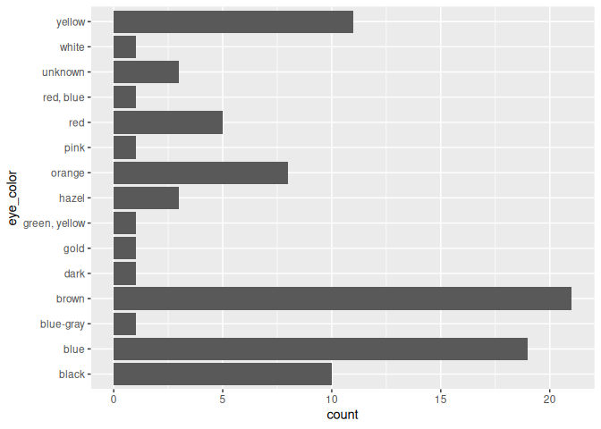
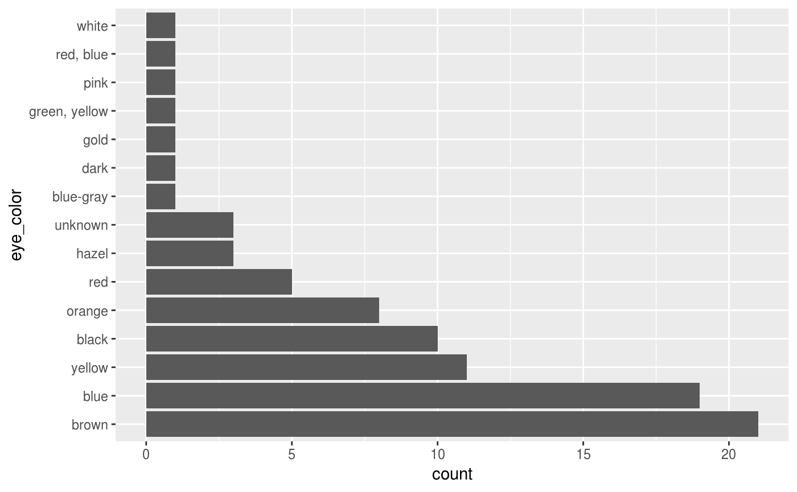

# forcats

## Overview

R uses **factors** to handle categorical variables, variables that have
a fixed and known set of possible values. Factors are also helpful for
reordering character vectors to improve display. The goal of the forcats
package is to provide a suite of tools that solve common problems with
factors, including changing the order of levels or the values. Some
examples include:

- [`fct_reorder()`](https://forcats.tidyverse.org/dev/reference/fct_reorder.md):
  Reordering a factor by another variable.
- [`fct_infreq()`](https://forcats.tidyverse.org/dev/reference/fct_inorder.md):
  Reordering a factor by the frequency of values.
- [`fct_relevel()`](https://forcats.tidyverse.org/dev/reference/fct_relevel.md):
  Changing the order of a factor by hand.
- [`fct_lump()`](https://forcats.tidyverse.org/dev/reference/fct_lump.md):
  Collapsing the least/most frequent values of a factor into “other”.

You can learn more about each of these in
[`vignette("forcats")`](https://forcats.tidyverse.org/dev/articles/forcats.md).
If you’re new to factors, the best place to start is the [chapter on
factors](https://r4ds.hadley.nz/factors.html) in R for Data Science.

## Installation

``` R
# The easiest way to get forcats is to install the whole tidyverse:
install.packages("tidyverse")

# Alternatively, install just forcats:
install.packages("forcats")

# Or the the development version from GitHub:
# install.packages("pak")
pak::pak("tidyverse/forcats")
```

## Cheatsheet

[](https://raw.githubusercontent.com/rstudio/cheatsheets/main/factors.pdf)

## Getting started

forcats is part of the core tidyverse, so you can load it with
[`library(tidyverse)`](https://tidyverse.tidyverse.org) or
[`library(forcats)`](https://forcats.tidyverse.org/).

``` r
library(forcats)
library(dplyr)
library(ggplot2)
```

``` r
starwars |> 
  filter(!is.na(species)) |>
  count(species, sort = TRUE)
#> # A tibble: 37 × 2
#>    species      n
#>    <chr>    <int>
#>  1 Human       35
#>  2 Droid        6
#>  3 Gungan       3
#>  4 Kaminoan     2
#>  5 Mirialan     2
#>  6 Twi'lek      2
#>  7 Wookiee      2
#>  8 Zabrak       2
#>  9 Aleena       1
#> 10 Besalisk     1
#> # ℹ 27 more rows
```

``` r
starwars |>
  filter(!is.na(species)) |>
  mutate(species = fct_lump(species, n = 3)) |>
  count(species)
#> # A tibble: 4 × 2
#>   species     n
#>   <fct>   <int>
#> 1 Droid       6
#> 2 Gungan      3
#> 3 Human      35
#> 4 Other      39
```

``` r
ggplot(starwars, aes(x = eye_color)) + 
  geom_bar() + 
  coord_flip()
```



``` r
starwars |>
  mutate(eye_color = fct_infreq(eye_color)) |>
  ggplot(aes(x = eye_color)) + 
  geom_bar() + 
  coord_flip()
```



## More resources

For a history of factors, I recommend [*stringsAsFactors: An
unauthorized
biography*](https://simplystats.github.io/2015/07/24/stringsasfactors-an-unauthorized-biography/)
by Roger Peng and [*stringsAsFactors =
\<sigh\>*](https://notstatschat.tumblr.com/post/124987394001/stringsasfactors-sigh)
by Thomas Lumley. If you want to learn more about other approaches to
working with factors and categorical data, I recommend [*Wrangling
categorical data in R*](https://peerj.com/preprints/3163/), by Amelia
McNamara and Nicholas Horton.

## Getting help

If you encounter a clear bug, please file a minimal reproducible example
on [Github](https://github.com/tidyverse/forcats/issues). For questions
and other discussion, please use <https://forum.posit.co/>.
